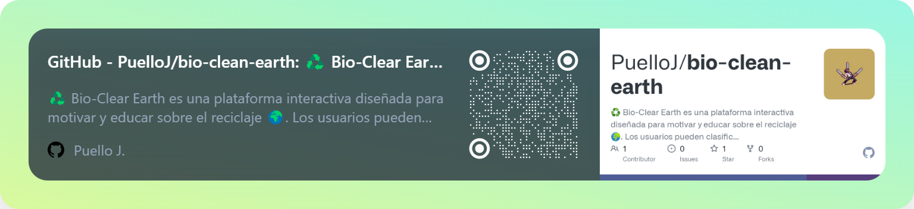

# 👋 ¡Bienvenidos a mi perfil de GitHub!

  

## 🧑‍💼 **Sobre mí**

- 📚 **Ingeniero de sistemas** con experiencia en el desarrollo de software.
- 🌱 Actualmente, trabajando en proyectos para **moviles**
- 🎮 En mi tiempo libre, disfruto de los **videojuegos**.
- 🏆 Me encanta incorporar elementos de **gamificación** en mis proyectos para mejorar la experiencia del usuario y motivar la participación.

## ⚙️ **Tecnologías y Herramientas**

  
  
  
  
  
  
  
  
  
  

<!-- ## 🛠️ **Proyectos en los que estoy trabajando**

  -->

## 📫 **Contáctame**

  
  
  

