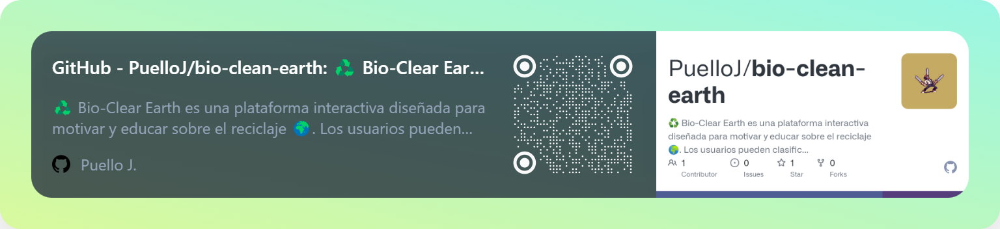

<div align="center">
  
</div>

<h1 align="center">
  
</h1>

<p align="center">
  <a href="https://github.com/PuelloJ">
    
  </a>
  <a href="https://github.com/PuelloJ?tab=followers">
    
  </a>
</p>

---

## 🚀 **Sobre Mí**

```typescript
const jose = {
  titulo: "Ingeniero de Sistemas",
  enfoque: ["Desarrollo Mobile", "Full Stack", "Gamificación"],
  actualmente: "Construyendo experiencias móviles excepcionales",
  pasion: "Transformar ideas en productos digitales innovadores",
  objetivo:
    "Crear soluciones que impacten positivamente la vida de las personas",
};
```

<table align="center">
  <tr>
    <td align="center" width="50%">
      
💡 **Innovación**
      
Creando soluciones tecnológicas que marcan la diferencia

</td>
    <td align="center" width="50%">
      
🎮 **Gamificación**
      
Incorporando elementos de juego para mejorar la experiencia

</td>
  </tr>
  <tr>
    <td align="center" width="50%">
      
📱 **Mobile First**
      
Experiencias móviles fluidas y atractivas

</td>
    <td align="center" width="50%">
      
🌱 **Aprendizaje Continuo**
      
Siempre explorando nuevas tecnologías

</td>
  </tr>
</table>

## 🛠️ **Stack Tecnológico**

### 💻 **Frontend & Mobile**

<p align="center">
  
  
  
  
  
  
  
  
  
</p>

### ⚙️ **Backend & Database**

<p align="center">
  
  
  
  
  
  
  
</p>

### 🔧 **Herramientas & Plataformas**

<p align="center">
  
  
  
  
  
  
  
  
  
  
</p>

<!-- ## 🛠️ **Proyectos Destacados**

[](https://github.com/PuelloJ/bio-clean-earth)  -->

## 📫 **Conectemos**

<div align="center">
  
🌟 **¿Tienes un proyecto en mente? ¡Hablemos!** 🌟

<p align="center">
  <a href="mailto:josepuello112000@gmail.com">
    
  </a>
  <a href="https://www.linkedin.com/in/jose-puello/">
    
  </a>
  <a href="https://github.com/PuelloJ">
    
  </a>
</p>

</div>

<div align="center">
  
</div>

<p align="center">
  <i>⚡ "El código es poesía, y cada proyecto es una historia por contar" ⚡</i>
</p>

<p align="center">
  💙 Hecho con pasión y muchas tazas de café ☕
</p>
